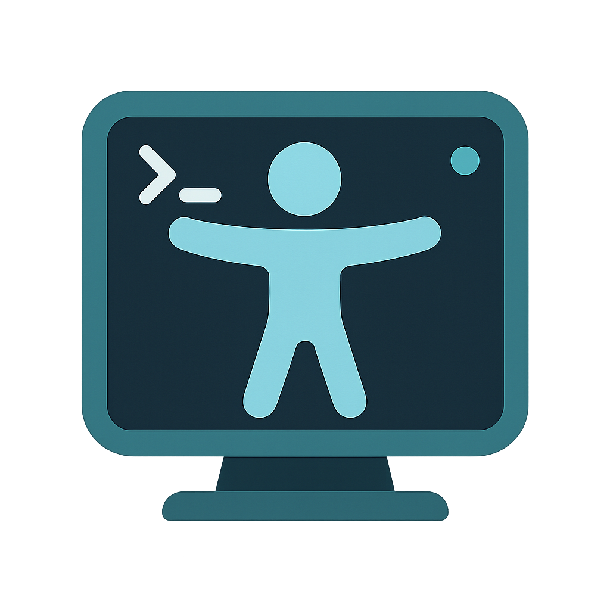

# Accessible Terminal

**Accessible Terminal** is a modern terminal designed to be user-friendly and fully accessible for blind and visually impaired users.  
It supports all traditional and advanced terminal commands with an organized and customizable graphical interface.

---

## ✨ Features

- Full support for all traditional **Terminal** commands.  
- Support for interactive commands such as **SSH, FTP**, and more.  
- Support for **Environment Variables**.  
- Integrated menu bar for easy navigation between options.  
- Informative status bar displaying system or process state.  
- Customizable settings to suit individual needs.  

---

## 📦 Requirements

- Python 3.8 or later  
- The following Python libraries:  
  - `wxPython`  
  - `paramiko`  

---

## ⚙️ Installation

1. Clone the repository:  
   ```bash
   git clone https://github.com/blind-tech/accessible-terminal.git
   cd accessible-terminal
````

2. Install the requirements:

   ```bash
   pip install -r requirements.txt
   ```

3. Run the application:

   ```bash
   python terminal.py
   ```

---

## 🤝 Contribution

Contributions are welcome!
You can fork the repository and then submit a pull request with your changes.

---

## License

This project is licensed under the MIT License.
See the [LICENSE](https://github.com/blind-tech/accessible-terminal/LICENSE) file for more details.

---

## 🙏 Acknowledgments

Special thanks to [**Abdullah Muhammed**](https://github.com/AbdullahMuhammed) for inspiring the idea of this project.
Your vision and inspiration played an important role in making this application possible.

---

## 👨‍💻 Developer

- **Name:** Mohammed Antar  
- **Email:** [mmuhammedantar22@gmail.com](mailto:mmuhammedantar22@gmail.com)  
- **Organization:** Antar Open Source Projects  
- **GitHub:** [github/MohammedAntar](https://github.com/mr-muhammed)  
- **LinkedIn:** [linkedin/in/MohammedAntar](https://www.linkedin.com/in/MohammedAntar)  
- **Twitter (X):** [twitter/MohammedAntar](https://twitter.com/MohammedAntar)

---

## 📩 Contact & Inquiries

<table>
  <tr>
    <td><strong>Email:</strong></td>
    <td><a href="mailto:techblindtech@gmail.com">techblindtech@gmail.com</a></td>
  </tr>
  <tr>
    <td><strong>Facebook:</strong></td>
    <td><a href="https://facebook.com/blindtech22/">BlindTech Facebook</a></td>
  </tr>
  <tr>
    <td><strong>Twitter (X):</strong></td>
    <td><a href="https://x.com/blindtech22/">BlindTech Twitter/X</a></td>
  </tr>
  <tr>
    <td><strong>YouTube:</strong></td>
    <td><a href="https://youtube.com/blindtech22/">BlindTech YouTube</a></td>
  </tr>
  <tr>
    <td><strong>Telegram:</strong></td>
    <td><a href="https://t.me/+t8-VVh69gU1jYmZk">BlindTech Telegram</a></td>
  </tr>
</table>

